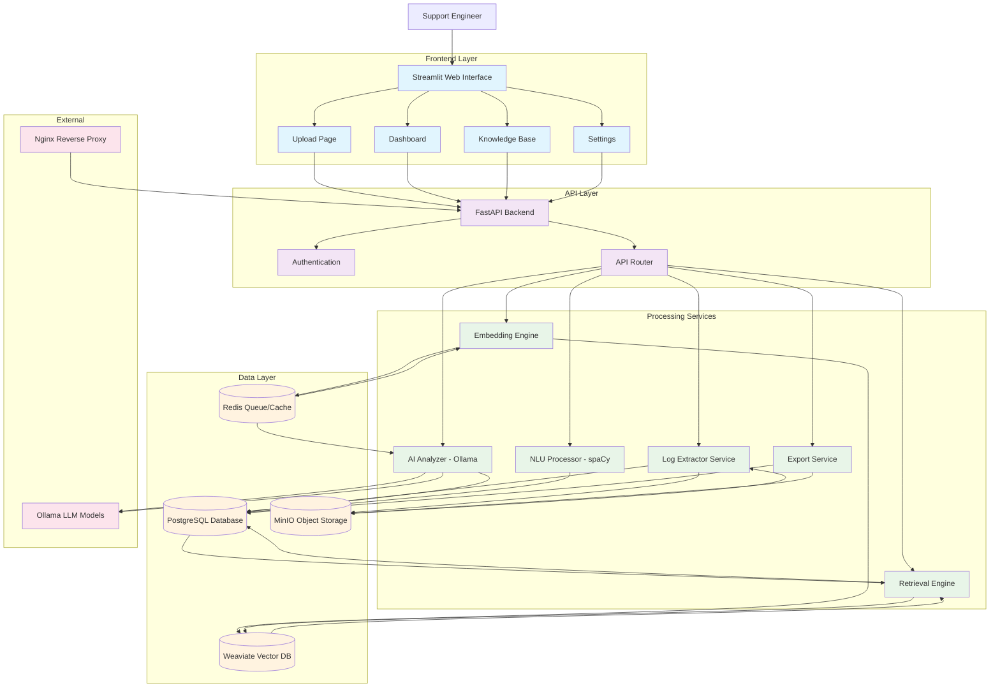
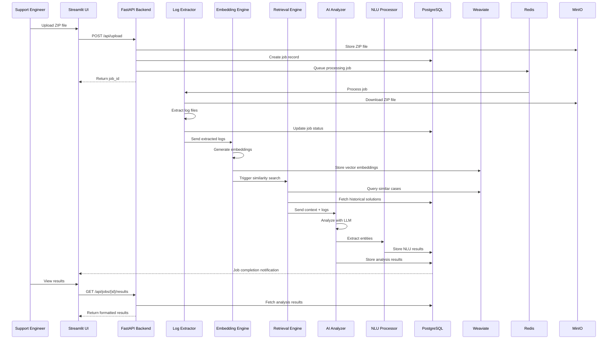
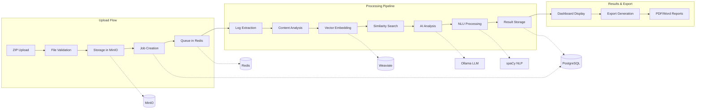
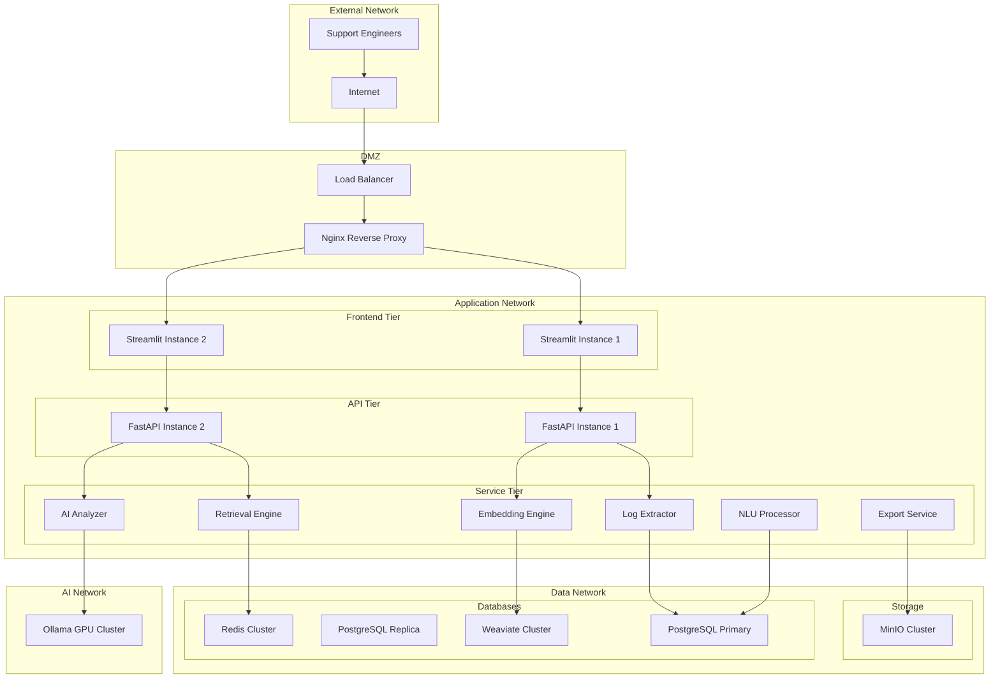
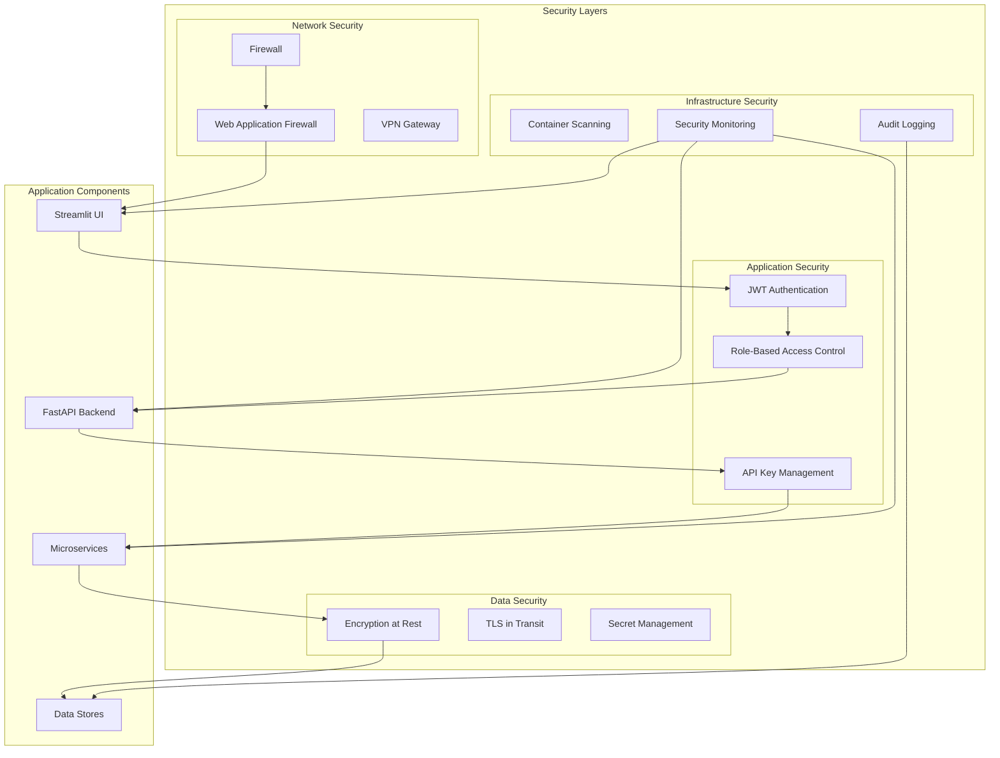
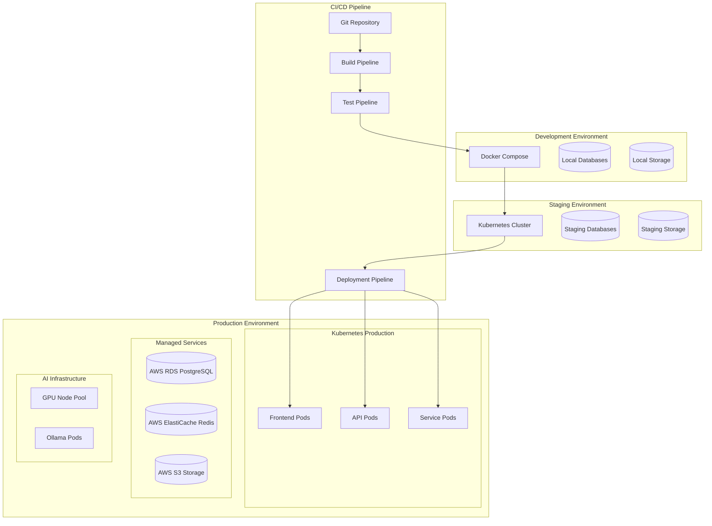
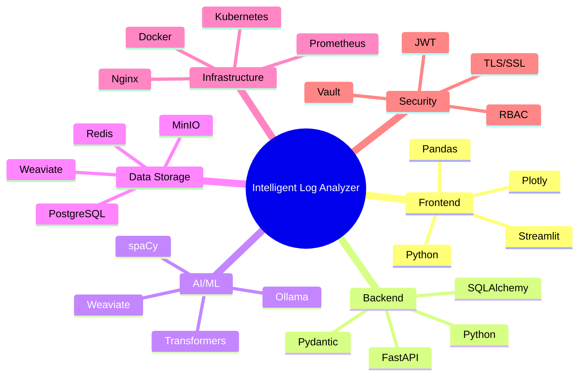
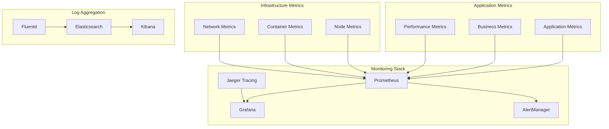

# System Diagram - Intelligent Log Analyzer

## High-Level Architecture Diagram

## Data Flow Diagram

## Component Interaction Diagram

## Network Architecture

## Security Architecture

## Deployment Architecture

## Technology Stack Diagram

## Performance & Monitoring

## Key Features

### 🏗️ **Microservices Architecture**
- **Scalable Design**: Independent services for different processing stages
- **Fault Tolerance**: Service isolation prevents cascade failures
- **Technology Diversity**: Each service optimized for its specific task

### 🔄 **Asynchronous Processing**
- **Queue-Based**: Redis queues for job management
- **Real-time Updates**: WebSocket connections for live progress
- **Parallel Processing**: Multiple workers for concurrent analysis

### 🤖 **AI-Powered Analysis**
- **Vector Similarity**: Weaviate for semantic search
- **LLM Integration**: Ollama for advanced reasoning
- **NLP Processing**: spaCy for entity extraction

### 📊 **Comprehensive Monitoring**
- **Health Checks**: Service availability monitoring
- **Performance Metrics**: Response times and throughput
- **Business Metrics**: Analysis success rates and user engagement

### 🔒 **Security First**
- **Authentication**: JWT-based user authentication
- **Authorization**: Role-based access control
- **Data Protection**: Encryption at rest and in transit
- **Audit Trail**: Comprehensive logging for compliance

This system diagram provides a complete visual representation of the Intelligent Log Analyzer's architecture, showing how all components interact to deliver AI-powered log analysis capabilities.
